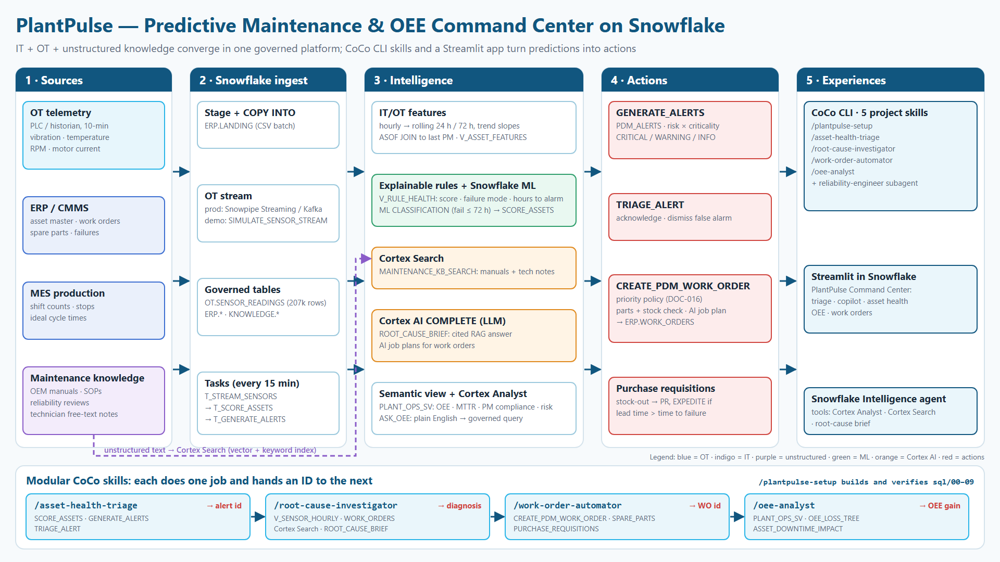
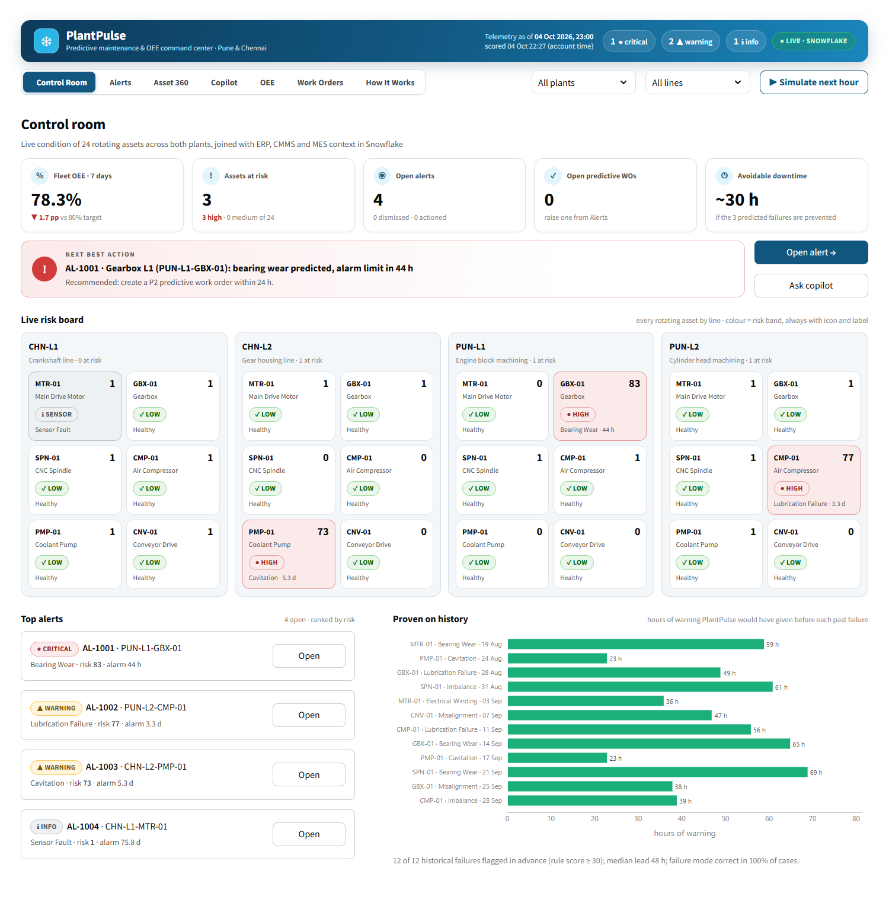
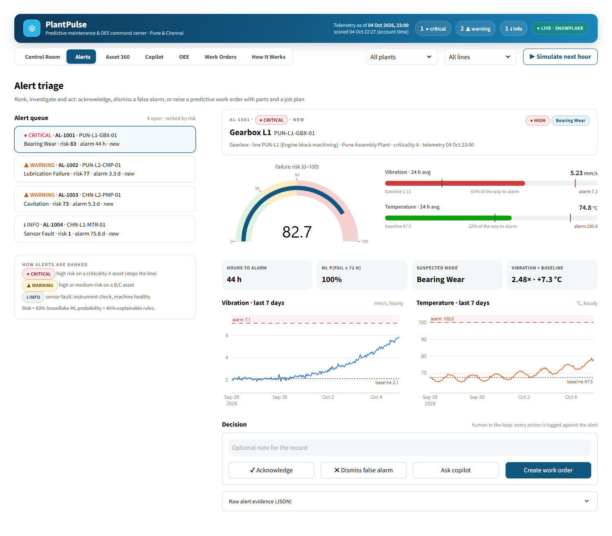
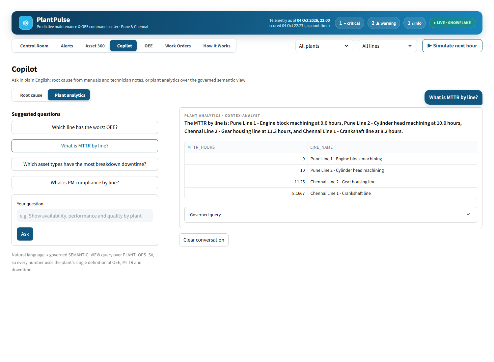
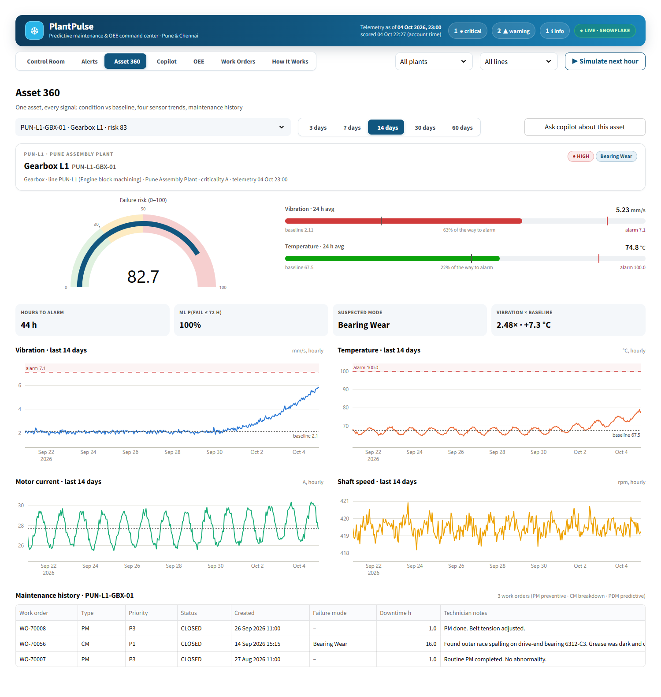
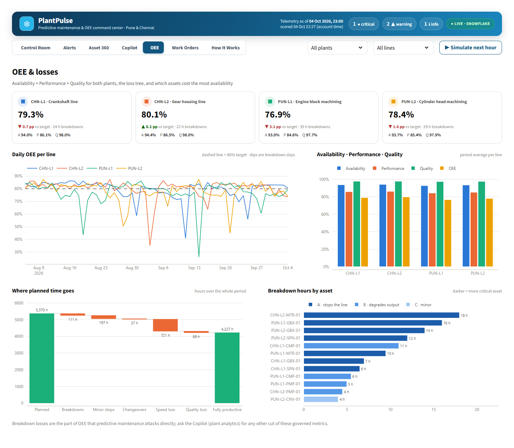
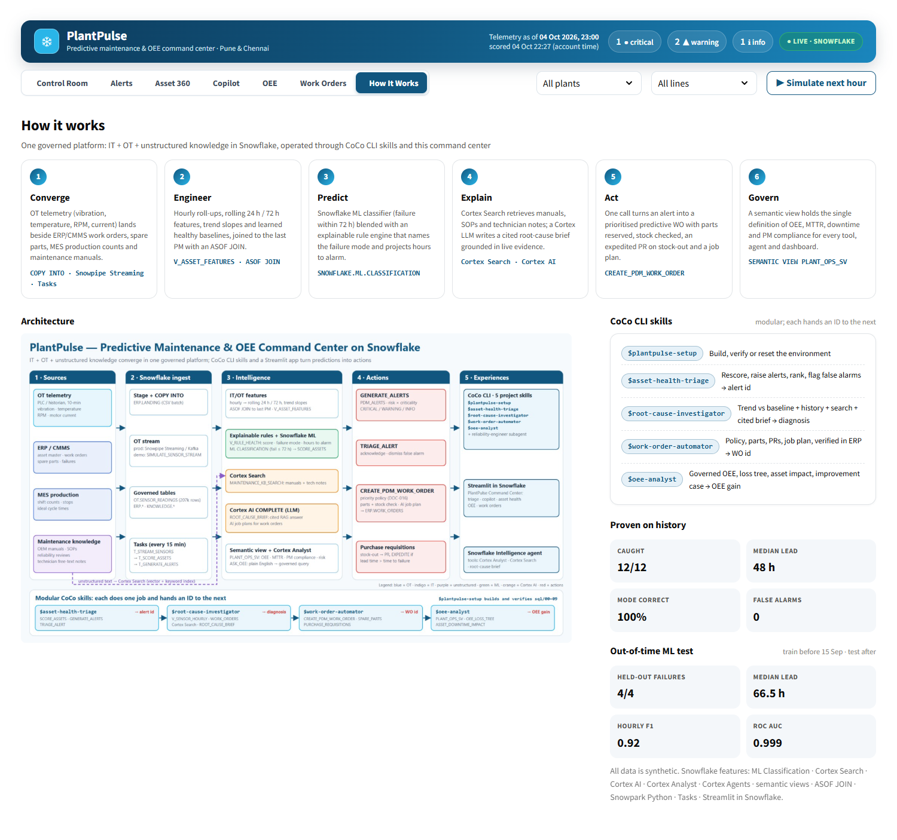

# PlantPulse: Predictive Maintenance & OEE Command Center on Snowflake

PlantPulse predicts failures of rotating equipment 1–3 days ahead, explains the root cause in plain English with citations, and turns each alert into a prioritised work order with parts checked. Everything runs inside Snowflake and is operated through modular **CoCo CLI (Cortex Code) skills** and a **Streamlit in Snowflake** command center.

> Built for the Snowflake CoCo CLI Hackathon (GCC Edition), challenge **Predictive Maintenance and OEE Command Center**. All data is synthetic.



## The problem

Plants lose output to unplanned downtime because machine sensor data (OT) lives in historians, separate from ERP/CMMS context (IT):

- **Alarms come too late.** Fixed alarm thresholds sit at the danger level. In our synthetic plant, all 12 breakdowns showed measurable degradation 4–7 days before failure, yet no alarm fired.
- **Root-cause analysis is slow.** Engineers spend hours reading manuals and old work orders.
- **Work orders are reactive.** They are raised after the breakdown, often while waiting for a part that is out of stock.
- **OEE losses aren't tied to assets.** Production managers can't see which machine is costing them availability.

Baseline in the demo data: 2 plants, 4 lines, 24 assets and 60 days. There were **12 breakdowns, 113 h of downtime and ₹18.1 lakh in corrective cost**. Fleet OEE is **78.7%** against an 80% target, with PUN-L1 lowest at 76.9%.

## What PlantPulse does

| Challenge requirement | How PlantPulse covers it | Where |
|---|---|---|
| Correlate sensor streams (vibration, temperature, RPM) with ERP and maintenance records | Hourly → rolling 24 h/72 h features with trend slopes, learned per-asset baselines, an `ASOF JOIN` to the last preventive maintenance, and asset master limits | `sql/02_features.sql` |
| Predict failures in advance | Snowflake ML Classification (failure ≤ 72 h) blended 60/40 with an explainable rule engine that names the failure mode and projects hours to alarm | `sql/03_ml_model.sql` |
| Root-cause investigation in natural language | Cortex Search over manuals, SOPs and technician notes, plus Cortex AI `COMPLETE`, produce a cited brief (`ROOT_CAUSE_BRIEF`) | `sql/05`, `sql/07`, `/root-cause-investigator` |
| Automate work orders | `CREATE_PDM_WORK_ORDER` applies the priority policy, reserves parts, checks stock, raises an expedited purchase requisition on a stock-out, and writes an AI job plan to `ERP.WORK_ORDERS` | `sql/07_automation.sql`, `/work-order-automator` |
| Lift OEE | OEE by shift and day, a loss tree, breakdown impact per asset, and a governed semantic view (`PLANT_OPS_SV`) with OEE, MTTR and PM compliance. `ASK_OEE` answers plain-English KPI questions from that view | `sql/04`, `sql/06`, `sql/10`, `/oee-analyst` |
| Conversational access for everyone | Cortex Agent `PLANTPULSE_RELIABILITY_AGENT` in Snowflake Intelligence, built on the semantic view, Cortex Search and the root-cause procedure | `sql/11_cortex_agent.sql` |
| Command center for alert triage and action | Streamlit in Snowflake app: alert queue, evidence and trends, acknowledge / dismiss / create WO, copilot, OEE and work orders | `app/streamlit_app.py` |
| Near-real-time loop | Stream simulator plus chained tasks: ingest → score → alert every 15 min (Snowpipe Streaming in production) | `sql/08_streaming_and_tasks.sql` |

Snowflake features used: Snowflake ML Classification · Cortex Search · Cortex AI `COMPLETE` · Cortex Analyst · Cortex Agents (Snowflake Intelligence) · semantic views · `ASOF JOIN` · Snowpark Python stored procedures · Snowflake Scripting · Tasks · Streamlit in Snowflake.

## CoCo CLI skills

Five modular skills live in [`.cortex/skills/`](.cortex/skills). Each does one job, always queries live tables, shows the SQL it runs, and hands a clear ID (asset, alert or WO) to the next skill. A subagent, [`.cortex/agents/reliability-engineer.md`](.cortex/agents/reliability-engineer.md), chains them end to end.

| Skill | Input → Processing → Output |
|---|---|
| `/plantpulse-setup` | Connection → health check of tables, model, search service, semantic view, procedures and tasks; builds whatever is missing → status table |
| `/asset-health-triage` | "Which assets are at risk?" → `SCORE_ASSETS` (ML + rules) and `GENERATE_ALERTS` → ranked alert queue with evidence and false-alarm flags; acknowledge or dismiss after confirmation |
| `/root-cause-investigator` | Asset ID + question → 7-day trend vs baseline, CMMS history of this and same-type assets, Cortex Search, `ROOT_CAUSE_BRIEF` → diagnosis, evidence with `DOC-`/`WO-` citations, confidence and action |
| `/work-order-automator` | Alert ID → priority policy, parts and stock preview, confirmation, `CREATE_PDM_WORK_ORDER` → verified `WO-PDM-9xxxx` with job plan and any purchase requisitions |
| `/oee-analyst` | OEE question → `SEMANTIC_VIEW(PLANT_OPS_SV …)`, loss tree, breakdown impact per asset → OEE gap and the quantified gain from preventing predicted failures |

Example session in CoCo:

```text
/skill list
/plantpulse-setup check that PlantPulse is ready
/asset-health-triage Which assets are at risk right now?
/root-cause-investigator Why is PUN-L1-GBX-01 vibration rising and what should we do?
/work-order-automator Create the predictive work order for the gearbox alert
/oee-analyst Which line has the worst OEE and what is it costing us?
```

## Command Center (Streamlit in Snowflake)

A full-screen, multi-page app: **Control Room · Alerts · Asset 360 · Copilot · OEE · Work Orders · How it works**. It runs as Streamlit in Snowflake (live) and as a [public browser demo](https://ekatantra.github.io/plantpulse/) on the synthetic data.

| Control Room | Alert triage |
|---|---|
|  |  |
| **Copilot · plant analytics (Cortex Analyst)** | **Asset 360** |
|  |  |
| **OEE & losses** | **How it works** |
|  |  |

## Results (synthetic back-test)

| Metric | Result |
|---|---|
| Historical failures flagged in advance | **12 / 12** |
| Median warning lead time | **48 h** (range 23–69 h) |
| Failure mode correctly identified | **12 / 12** (bearing wear, cavitation, lubrication, imbalance, misalignment, winding) |
| False alarms outside degradation windows | **0** (the sensor glitch is classified as `SENSOR_FAULT`) |
| ML classifier, random hold-out | F1 (FAIL) 0.99, AUC 1.00, optimistic because the split is random; see [model metrics](docs/model_metrics.md) |
| ML classifier, out-of-time (train before 2026-09-15, test after) | Hourly F1 (FAIL) 0.92 (precision 0.88, recall 0.95) at p ≥ 0.5. Held-out failures caught **4 / 4**, median lead 66.5 h. The 34 "false-alarm" hours are all early warnings before a real failure. Only 4 test events. `ANALYTICS.ML_VALIDATION` |
| Current state | 3 assets will fail in 26–40 h (gearbox bearing, compressor lubrication, pump cavitation), plus 1 false alarm to dismiss |
| Improvement case for PUN-L1 | +1.7 points of availability and ≈ +1.4 OEE points if breakdowns become planned stops (assumes a planned repair takes 35% of breakdown time) |

The rule engine is unit-tested in [`tests/test_rules.py`](tests/test_rules.py) through a pandas mirror of the SQL logic in `app/local_engine.py`.

## Quick start

**Prerequisites**
- A Snowflake account with Cortex AI functions, Cortex Search and Snowflake ML. A trial account works. If an LLM is not available in your region, an ACCOUNTADMIN can run `ALTER ACCOUNT SET CORTEX_ENABLED_CROSS_REGION = 'ANY_REGION'`.
- Python 3.11+ and [CoCo CLI](https://docs.snowflake.com/en/user-guide/cortex-code/cortex-code-cli).

```bash
python -m venv .venv && source .venv/bin/activate          # Windows: .venv\Scripts\activate
pip install "snowflake-connector-python[pandas]" snowflake-cli pandas numpy streamlit plotly pytest

snow connection add            # e.g. name it "plantpulse"; key-pair (SNOWFLAKE_JWT) or PAT recommended
snow connection test -c plantpulse

python scripts/deploy.py -c plantpulse                     # 00 setup → load → features → ML → OEE → search → semantic view → automation → tasks → app
python -m pytest tests/ -q                                 # rule-engine back-test
```

Step by step instead of the one-shot deployer:

```bash
snow sql -c plantpulse -f sql/00_setup.sql
snow stage copy data/ @PLANTPULSE.ERP.LANDING --overwrite   # COPY INTO in 01 expects the .csv.gz that PUT/stage copy produces
snow sql -c plantpulse -f sql/01_load.sql                   # then 02 … 08 in order
```

**Use the skills:** run `cortex -c plantpulse` from the repo root (CoCo picks up `.cortex/skills`), then try the prompts above.

**Open the app:** Snowsight → Projects → Streamlit → `PLANTPULSE_COMMAND_CENTER`. The same app also runs without Snowflake in **demo mode** on the bundled CSVs: `streamlit run app/streamlit_app.py`, or in the browser at https://ekatantra.github.io/plantpulse/ (built with `python scripts/build_pages.py`).

**Reset before a demo:** `snow sql -c plantpulse -f scripts/demo_reset.sql` restores alerts AL-1001 to AL-1004 and removes demo work orders.

**Live loop (optional):** resume the tasks with `ALTER TASK ANALYTICS.T_GENERATE_ALERTS RESUME;` and the same for `T_SCORE_ASSETS` and `T_STREAM_SENSORS`. Suspend them again afterwards to save credits.

## Repository layout

```
data_gen/      synthetic IT/OT generator (seed 42) and the maintenance knowledge corpus
data/          generated CSVs: telemetry, assets, work orders, failures, parts, production, documents
sql/00-11      Snowflake build, in order (03b out-of-time ML validation, 10 ASK_OEE, 11 Cortex Agent)
app/           Streamlit command center (Streamlit in Snowflake, with a local demo-mode fallback)
.cortex/       CoCo CLI skills and the reliability-engineer subagent
scripts/       one-shot deployer and demo reset
tests/         back-test of the rule engine
docs/          architecture diagram, model metrics, demo script
```

## Design notes

- **"Now" is the last telemetry timestamp** (2026-10-05 00:00), not the wall clock, so the demo is reproducible.
- **Risk × consequence.** Alert severity combines the risk band with asset criticality (A stops the line). Work-order priority follows the plant policy in DOC-016: P2 means failure is predicted within 72 h on a criticality A/B asset.
- **Explainable first.** Every alert carries its evidence (vibration × baseline, temperature delta, slope, hours to alarm, ML probability). The rule engine also works on its own if ML is unavailable (`SCORE_ASSETS(FALSE)`).
- **Guardrails.** Skills ask before every write. The LLM falls back to a second model, then to a templated answer. Saturated transmitter readings are filtered out as data-quality events.

## Roadmap

- CMMS write-back (SAP PM / Maximo) and a mobile technician view
- Vibration spectra and FFT features (bearing defect frequencies), plus energy KPIs
- Snowpipe Streaming from the plant historian, and per-site rollout through a new skill and semantic-view extension
- Re-run the out-of-time ML validation (`sql/03b`) on real failure history as it accumulates

## Disclaimer

All plants, assets, readings, work orders, costs and documents are **synthetic** and generated by `data_gen/`. They do not represent any real company. Results on real equipment will differ.

## License

[MIT](LICENSE)
